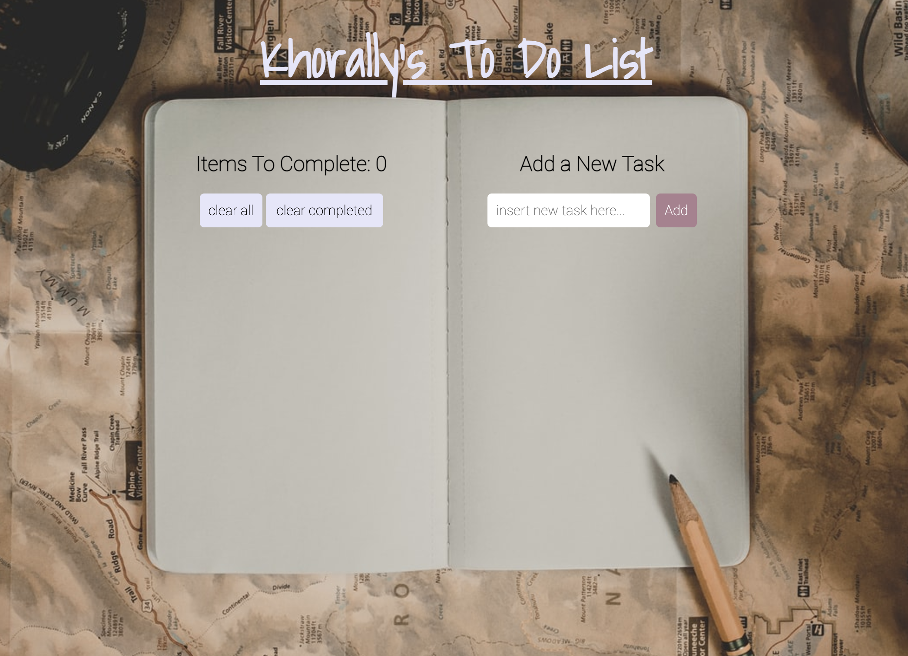

# Khorallys-ToDo-List-Express

Welcome to my To-Do list! Here, users can use this to-do list to add, clear, and clear all items that are completed. Check out the deployed version on Heroku [here](https://khorallypexpress.herokuapp.com/).

# How It's Made:
Tech used: HTML, CSS, JavaScript, and MongoDB. I especially enjoyed incorporated the node_modules in this project so that it could work server site in addition to client side.

# Lessons Learned:
I learned that when running files server-side it's important to kill the server and rerun node server.js in the command line every time.  I also learned that the best way to debug Node js is by using console.log()

5/11/21 - added scroll feature to my list so that tasks don't continue to list themselves off the page.

next steps: in my next version  I will make it so that the list can be reordered. I also create a keydown event so that when 'enter' is pressed a new item is added to the list. That way 'add' does not need to be clicked to add new items on the list. 

Examples:
Take a look at these couple examples that I have in my own portfolio:

https://wonderful-easley-4bdc4b.netlify.app/

https://hopeful-hamilton-96af68.netlify.app/

https://zealous-dubinsky-e78c32.netlify.app
